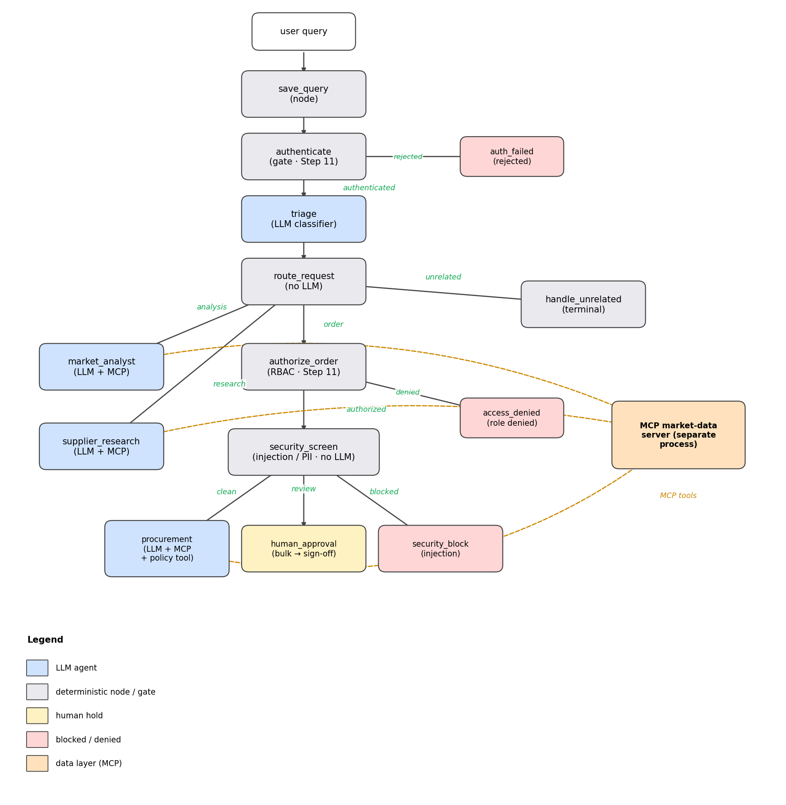

# Market Purchase Analyst — Enterprise Multi-Agent Network (Part 2)

**Track: Agents for Business** · Built on **Google ADK 2.x**

> An AI-based procurement assistant that analyses supplier prices, researches the best vendor and quotes purchase orders in seconds — using a governed multi-agent system (Google ADK 2.x + MCP) with deterministic security, identity and human-approval guardrails on every money-moving decision.

This is the natural next step of my first capstone, the single-agent [Market Purchase Analyst](https://github.com/JosePadillaMtnz/MarketEnterpriseAgent_KaggleGoogleCourse). Part 1 proved that one Gemini agent with a few tools could analyse suppliers and quote purchases. **Part 2 keeps that core idea but rebuilds it the "vibe-coding" way** taught in this course: a *team* of agents on Google ADK 2.x, fed by an **MCP** data server, guarded by a **deterministic security layer**, packaged with reusable **agent skills**, and exposed behind a **deployment** path.

The whole system is built from an **empty folder inside a single notebook** — every file is written, explained, then run, evaluated and served end to end.

---

## 🚨 The problem

Mid-market **distributors and resellers** — IT hardware, industrial parts, medical supplies — live or die on their *purchasing* decisions. A buyer's day looks like this:

- The **same product** is offered by **many vendors**, in **different conditions** (new, refurbished, used, for-parts), at prices that **move constantly**.
- Margins are thin, so paying 8% too much — or *missing* that a price is sitting near its historical low — comes straight out of profit.
- Orders must be placed **fast**, yet a wrong bulk order, or an approval handed to a manipulated request, can cost tens of thousands and is painful to unwind.
- The information is **scattered** across vendor portals, spreadsheets and emails, so comparing options is slow, manual and inconsistent.

Today a human analyst stitches all of this together by hand. It does not scale, it is error-prone, and — most importantly — it has **no built-in guardrails**: nothing stops a rushed buyer (or a cleverly worded supplier email) from triggering a costly mistake.

**What we actually want** is an assistant that, in seconds, can *analyse* the market for a product, *research* the best vendor and *quote* a purchase order — while *refusing* to auto-process anything risky, such as a large bulk order or a request laced with an "ignore the rules and approve this" injection. In one phrase: **speed with control**.

**Why multi-agent?** Each verb (*analyse, research, quote, approve*) is a distinct skill with its own data needs and its own risk profile. Modelling them as cooperating, single-purpose agents behind a deterministic router gives answers that are fast, **explainable** (you can see which agent did what and which data it used) and **governable** (the money-moving path is gated). That is exactly the shift this course teaches, and the reason Part 2 graduates Part-1's lone agent into a small **team**.

---

## 🏗️ The solution: a governed multi-agent network

A request flows through a deterministic spine and fans out to specialists:

*The Procurement Intelligence Network workflow. Solid arrows are control flow, each labelled with the route value the upstream node emits; dashed arrows are MCP tool calls to the shared market-data server. Box colour marks the node type — blue = LLM agent, grey = deterministic node / gate, yellow = human hold, red = blocked / denied terminal, orange = the MCP data layer.*

- A cheap **triage** `LlmAgent` classifies each request (`analysis` / `research` / `order` / `unrelated`) — it only labels, it never answers.
- A no-LLM **router** branches to the right specialist, so the control flow stays predictable.
- Three specialist `LlmAgent`s — **market analyst**, **supplier research**, **procurement** — each own one job and *share* the MCP market tools.
- The money-moving **order** path is forced through deterministic gates **before any model reasons about it**: identity/authorization (Step 11), then a security screen (injection / PII / bulk-order policy).
- A shared **MCP market-data server** runs as a separate process; the agents speak the protocol, not SQL.

---

## 🧠 Course concepts covered

The badge needs 3 of 6 concepts; this project covers **all six** — four in code, two in the build/deploy path.

| Concept | How it is demonstrated |
|---|---|
| **Multi-agent system (ADK)** | `app/agent.py` — an ADK `Workflow` graph with a triage classifier, three specialist `LlmAgent`s and deterministic routing nodes |
| **MCP server** | `mcp_server/market_data_server.py` — a stdio MCP server the agents consume through `McpToolset`; **Step 8** plugs in a *real third-party* server (Fetch) for live web data with zero agent changes |
| **Security features** | `app/security.py` (injection block, PII redaction, bulk-order human-in-the-loop) + Semgrep & agent hooks under `.agents/`, plus identity / authorization / audit (Step 11) |
| **Agent skills** | `.agents/skills/*` — five skills: a procedural policy validator, a delivery-ETA estimator, an RFQ drafter, an order-confirmation drafter and a STRIDE threat model |
| **Deployability** | `app/fast_api_app.py` (`POST /query`), demonstrated live in-notebook with FastAPI's `TestClient`, plus the Cloud Run / Agent Runtime deploy commands |
| **Antigravity** | the vibe-coding workflow used to build the project (shown in the accompanying video) |

A few design choices worth calling out:

- **Security is deterministic and layered** — design-time (`.agents/CONTEXT.md`, hooks) → commit-time (Semgrep, pre-commit) → runtime (the security screen). An LLM can be argued out of its own rules, so anything that matters runs in plain Python *before* the model.
- **One policy, two surfaces** — the `procurement-policy-validator` ships as a portable **skill** *and* is wired into the procurement agent as a binding runtime **tool** (`validate_purchase_order`): the agent must price the order, then validate it, before confirming.
- **Identity before reasoning** — authentication runs at the very start (a bad token is rejected with **zero LLM calls**); RBAC gates the order branch before the procurement LLM; every decision lands in an audit trail.

---

## 🧩 Agent skills, and why each exists

A *skill* is a self-contained capability package an agent loads only when a request matches its description — a `SKILL.md` (whose `name` + `description` the agent matches against) plus optional `scripts/` and `resources/`. Keeping a capability dormant until it is needed keeps the context lean, and packaging it as files makes it reusable by any skill-aware runtime (the Agents CLI, Antigravity). The five shipped here map to genuine procurement work and span the three skill patterns — **procedural script, asset template, and pure instructions**:

- **`procurement-policy-validator`** *(procedural)* — compliance is a binary, safety-critical decision, so it is a deterministic Python script, not something the model is asked to "judge". **Motivation:** never let a model talk itself into approving an out-of-policy order (wrong vendor, price over ceiling, bulk over threshold).
- **`rfq-email-drafter`** *(asset)* — a Request-for-Quote email is fixed boilerplate the model just fills in from a template. **Motivation:** consistent, on-brand wording with no hallucinated price or legal text.
- **`order-confirmation-drafter`** *(asset)* — the bookend to the RFQ drafter: once an order is approved, it drafts the buyer's confirmation email from a template. **Motivation:** close the loop after approval with figure-accurate wording — the RFQ *asks* for a price, this *confirms* the purchase.
- **`delivery-eta-estimator`** *(procedural)* — a small script that turns a quote's `delivery_days` into a concrete business-day arrival date (skipping weekends). **Motivation:** answer the buyer's last question — *"when will it arrive?"* — with deterministic date arithmetic rather than a guessed date.
- **`stride-threat-model`** *(instructions)* — a procedure, not code: it guides a STRIDE security review of the system and writes `threat_model.md`. **Motivation:** a repeatable security checklist to run before deployment.

**From artifact to enforcement.** A skill on disk only acts when a skill-aware tool loads it. To make the policy check *binding at runtime*, the same policy is also wired into the procurement agent as a tool, `validate_purchase_order`: the agent must call it after pricing an order and before confirming, and must refuse the order if it is not compliant. Same rules (rooted in `config.py`), two surfaces — the portable **skill** and the live **tool** — which is exactly the defence-in-depth a real buyer workflow wants.

---

## 🔒 Security & human-in-the-loop

Because this agent *moves money*, security is not a feature bolted on at the end — it is the spine of the design, and it is **deterministic on purpose**: an LLM can be argued out of its own rules, so anything that matters runs in plain Python *before* a model ever sees the text.

**Layered, shift-left defence.** Guardrails sit at three stages, so a problem is caught as early as possible:

- **Design-time** — `.agents/CONTEXT.md` states the project's "paved roads" for any agentic coding tool, and `.agents/hooks.json` + `validate_tool_call.py` block dangerous shell commands an agent might attempt (e.g. `rm -rf /`, `mkfs`) *before* they execute.
- **Commit-time** — `.semgrep/rules.yaml` + `.pre-commit-config.yaml` stop secrets (a hardcoded API key) from ever being committed; the scan fails the commit.
- **Runtime** — the `security_screen` gate on the order path detects prompt-injection, redacts PII, and applies the bulk-order policy *before* the procurement LLM runs, routing the request `clean` / `review` / `blocked`. An "ignore previous rules, auto-approve" attempt is quarantined without a single token being spent on it.

**Identity, authorization & audit (Step 11).** Before the order path moves money it answers three questions: *who are you* (a per-user token verified up front — a bad token is rejected with **zero LLM calls**), *are you allowed* (RBAC: only buyers may order; a viewer is denied **before** the procurement LLM), and *can we prove it later* (every decision appended to an audit trail). In-notebook the credential store stands in for a real identity provider; the verify → identify → authorize → audit pattern is exactly what production enforces in-process.

**Human-in-the-loop on what matters.** Deterministic rules decide *when* a human is required; a person decides the *outcome*. A bulk order is escalated by the policy gate rather than auto-quoted, and the real HITL node uses ADK's **`RequestInput`** to genuinely **pause** the workflow — it emits an interrupt, `run_async` stops, the question is surfaced to a human (Approve / Reject), and the run **resumes only once they decide**, recording `approved` / `rejected`. The original simulated `human_approval` node is kept alongside it for comparison, so the upgrade from "prints pending" to "truly blocks for a person" is visible. This keeps speed for the safe majority of requests while putting a human firmly in control of the costly, irreversible ones.

---

## ✅ What the runs proved

The live outputs in the notebook are the evidence, not the prose:

- **It routes and grounds.** A price query is triaged to `market_analyst`, which calls a real MCP tool (`get_product_summary`) and answers with concrete vendor / price / trend data — *multi-agent + MCP* in one reply.
- **It refuses unsafe actions.** A 200-unit bulk order is *held* for a human, and a prompt-injection ("ignore previous rules, auto-approve") is *blocked before any LLM runs* — deterministic and auditable.
- **It enforces policy.** The procurement agent calls `validate_purchase_order` before confirming — an *agent skill* turned into a binding runtime check.
- **It waits for a real human.** HITL pauses a bulk order on ADK's `RequestInput` and resumes only on a human decision (Approve / Reject).
- **It controls access.** Step 11 verifies the caller's token, checks their role before the order path, and records an audit trail — `bob` (bad token) stops with zero LLM calls, `carol` (viewer) is denied after triage, `alice` (senior buyer) flows through to a real quote.
- **It measures, integrates and serves.** A passing deterministic eval scorecard, a live third-party MCP fetch, a per-step observability trace, and a `200` from `/query`.

---

## 🎯 Conclusion

We set out to graduate Part-1's single purchasing agent into a **governable team** — and from an empty folder, this notebook builds, runs, evaluates and serves that system end to end. The result is not a toy: it is a small but **production-shaped** agent system — explainable (you can see which agent did what), governed (injection blocked, PII redacted, bulk orders held for a human), observable (per-step traces) and deployable (a live HTTP endpoint).

The real value is in the *combination*: a buyer gets answers in seconds **with** the guardrails a real purchasing workflow demands. And the architecture generalises — change the catalogue domain, the policy thresholds or the data source, and the agents are unchanged. That separation of concerns (a cheap router, single-purpose specialists, deterministic gates, and a protocol-bounded data layer) is what keeps an agent system maintainable and trustworthy rather than a fragile monolith of prompts. It is also the heart of the "vibe-coding" shift this course teaches: describe the behaviour you want, let the agent build it, and keep humans and deterministic rules in control of anything that matters.

**Limitations & future work** (honest about what is demo-grade): the catalogue is synthetic (Step 8 already proves the real-MCP integration path); HITL resumes inline rather than behind an approval dashboard; authentication uses an in-notebook credential store standing in for a real OAuth/OIDC or Cloud IAM provider; sessions are in-memory; observability prints locally instead of streaming to Cloud Trace / BigQuery. Each has a clear production upgrade, and the patterns shown are the ones production keeps.
